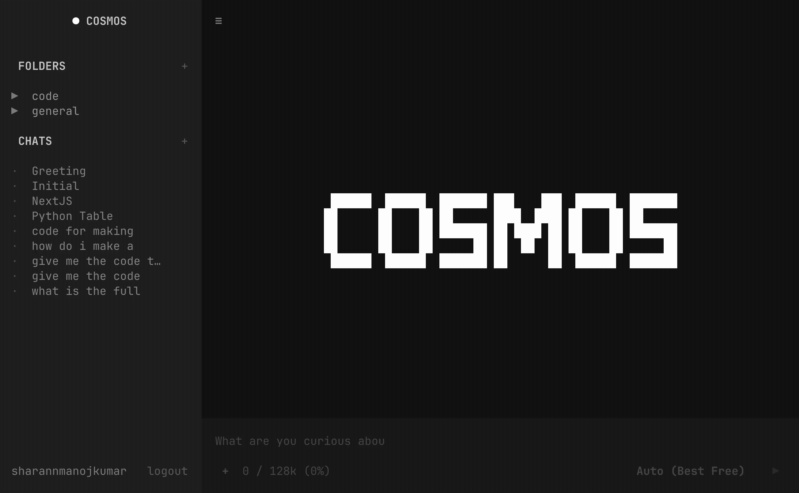

<div align="center">

# Cosmos

### The AI chatbot that lives in your terminal.

Twenty-five frontier models. Streaming responses. Cloud-synced history.
No subscription. No credit card. No config files.

```
pip install cosmos-ai
```

[**Website**](https://cosmos-tui.app) · [**Get Started**](#quickstart) · [**Features**](#features) · [**Models**](#models)


</div>


## What is Cosmos?

Cosmos is a fast, keyboard-driven AI chat client that runs entirely in your terminal. It speaks to 25+ free models through [OpenRouter](https://openrouter.ai) — DeepSeek R1, Llama 3.3, Gemini 2.0 Flash, and more — and renders their answers as live-streaming Markdown, syntax-highlighted code, tables, and charts, all inside a clean monochrome TUI.

No browser tab. No mouse. No `.env` files to babysit. You log in once, and your models, history, and folders follow you to every machine you touch.




## Quickstart

**1. Install**

```bash
pip install cosmos-ai
```

**2. Sign up** at [cosmos-tui.app](https://cosmos-tui.app)

Enter your name and your [OpenRouter API key](https://openrouter.ai/keys). That's it — your key is stored securely in your account, so there's nothing to configure locally.

**3. Launch**

```bash
cosmos
```

Log in once, and you're talking to frontier models in under a minute. Your key, history, and folders sync from the cloud automatically.

> **Why an account instead of a config file?** Because your setup should work on your laptop, your work machine, and that SSH session into a box you'll never see again — without copying secrets around. Sign in, and Cosmos pulls everything down.


## Features

### 25+ free models, switchable mid-conversation
Start a thread on Gemini 2.0 Flash for speed, hit `/models`, and finish it on DeepSeek R1 for deep reasoning — without losing context. Every model OpenRouter offers for free is one keystroke away.

### Real-time streaming
Tokens render the instant they arrive, with a pulsing `●` indicator so you always know the model is still thinking. No spinners, no waiting for the full response to land.

### Cloud-synced chat history
Every conversation is saved, organized into folders, and synced to your account. Close your laptop, open your desktop, pick up exactly where you left off.

### File attachments
Drop in images, PDFs, DOCX, code files, or plain text and ask questions about them. Cosmos handles the parsing — you handle the curiosity.

### Rich terminal output
Full Markdown rendering with tables, syntax-highlighted code blocks, Mermaid diagrams, and ASCII bar charts. Your terminal has never looked this good.


## Models

A taste of what's available out of the box, all **completely free** via OpenRouter:

| Model | Best for |
|-|-|
| **DeepSeek R1** | Deep reasoning, math, hard logic |
| **Llama 3.3 70B** | General chat, reliable all-rounder |
| **Gemini 2.0 Flash** | Speed, long context, quick answers |
| **Qwen 2.5** | Code generation, multilingual |
| **Mistral** | Lean, fast, efficient responses |
| **GPT-4o mini** | Balanced quality and latency |

…and 19 more.


## Pricing

Free. All of it.

No subscription, no credit card, no usage caps from us. You bring an OpenRouter API key (also free to create), and you only ever touch the free model tier. Cosmos is the interface; OpenRouter is the engine; your wallet stays closed.


## Built with

- **[Textual](https://textual.textualize.io/)** — the modern Python TUI framework
- **[OpenRouter](https://openrouter.ai)** — unified access to dozens of models
- **Python 3.10+**


## Contributing

Issues, ideas, and pull requests are welcome. Open an issue to start a discussion, or check the [open issues](https://github.com/Sharann-del/Cosmos/issues) for somewhere to jump in.

```bash
git clone https://github.com/Sharann-del/Cosmos.git
cd Cosmos
pip install -e .
```


## License

MIT — see [LICENSE](LICENSE).

